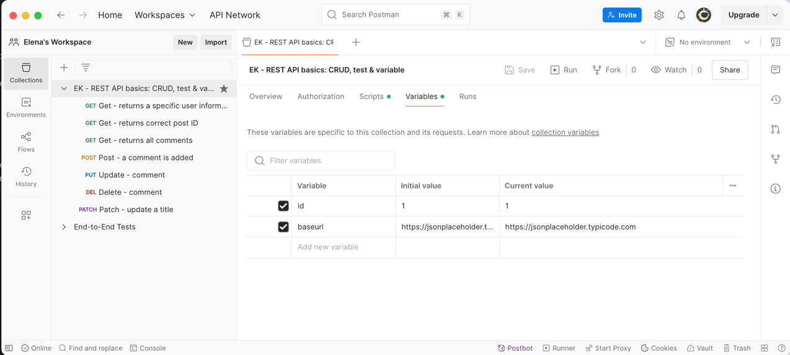
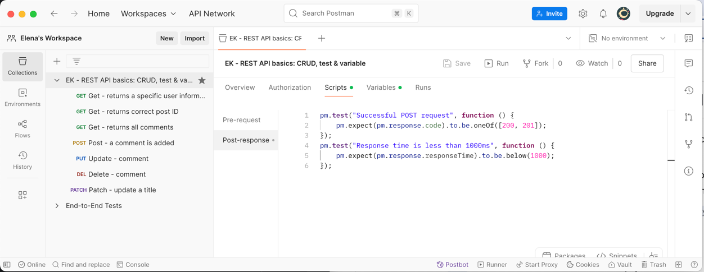

# API testing with Postman

This repository contains an export file from Postman - more information about this tool can be found here: https://learning.postman.com/docs/introduction/overview/

Information about the API that is used in this example can be found here: https://jsonplaceholder.typicode.com/


## Best practices when working with Postman
1. Organize your test cases by areas.
2. Use meaningful names for folders and test cases.
3. Implement detailed verifications in test cases: 
	- Check sresponse statuses.
	- Verify structures and content of responses. 
	- Include negative test cases to check how your system handles missing parameters, wrong values, unauthorized access, etc.
4. Use environmental and collection variables. You can access them via ```pm.collectionVariables.get("id")``` 
5. Setup pre-request and post-request scripts on a collection level that will be used by all test cases 
6. Do constant review and maintenance of all test cases. 